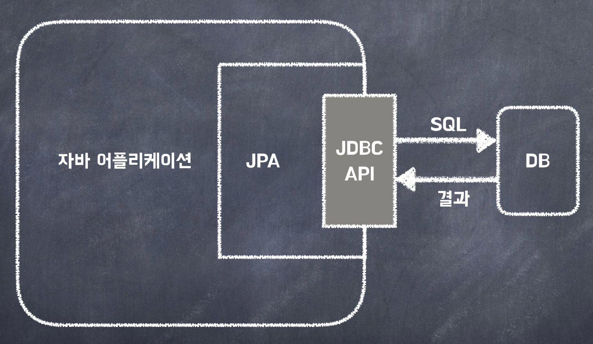
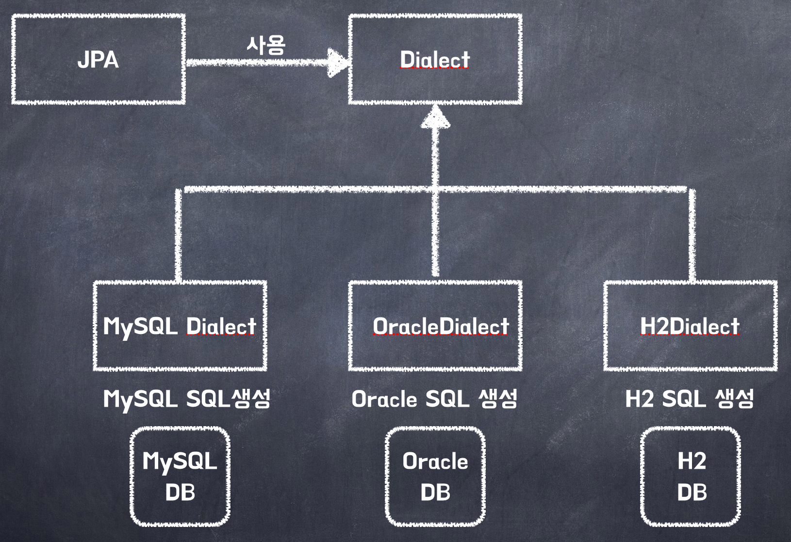

## JPA란 무엇인가?  
JPA (Java Persisitence API)는 하이버네이트(hibernate ) 기반 자바 진영의 ORM 기술 표준.  
JPA는 ORM을 사용하기 위한 인터페이스를 모아둔 것이며, JPA를 사용하기 위해서는 JPA를 구현한 Hibernate, EclipseLink, DataNucleus 같은 ORM 프레임워크를 사용해야 한다.    
어플리케이션과 JDBC 사이에서 동작  
  
    
## ORM (Object Relational Mapping)  
RDB 테이블을 객체지향적으로 사용하기 위한 기술, RDB는 객체지향적(상속, 다형성, 레퍼런스, 오브젝트 등)으로 접근하기  
쉽지 않다 때문에 ORM을 사용해 오브젝트와 RDB사이에 객체지향적으로 다루기 위한 기술  
   
## Hibernate란?  
Boss에서 개발한 ORM(Object Relational Mapping) 프레임워크  
#### 장점  
* Hibernate는 특정 클래스에 매핑되어야 하는 데이터베이스의 테이블에 대한 관계 정의가 되어 있는 XML 파일의 메타데이터로 객체관계 매핑을 간단하게 수행
* Hibernate를 사용하면 데이터베이스가 변경되더라도 SQL 스크립트를 수정하는등의 작업을 할 필요가 없다.  
* 애플리케이션에서 사용되는 데이터베이스를 변경시키고자 한다면 설정파일의 dialect 프로퍼티를 수정함으로서 쉽게 처리할 수 있다.  
* Hibernate는 MySQL, Oracle, Sybase, Derby, PostgreSQL를 포함한 많은 데이터베이스를 지원하며 POJO기반의 모델과도 원활하게 동작한다.  
   
   
## 왜 JPA를 사용해야 하는가?  
#### 생산성  
* JPA를 자바 컬렉션에 객체를 저장하듯 JPA에게 저장할 객체를 전달.  
* INSERT SQL을 작성하고 JDBC API 사용하는 지루하고 반복적인 일을 JPA가 대신 처리해준다.  
* CREATE TABLE같은 DDL문 자동 생성  
* 데이터베이스 설계 중심의 패러다임을 객체 설계 중심으로 역전  

#### 유지보수  
* 엔티티에 필드 추가시 등록, 수정, 조회 관련 코드 모두 변경  
* JPA를 사용하면 이런 과정을 JPA가 대신 처리  
* 개발자가 작성해야 할 SQL과 JDBC API 코드를 JPA가 대신 처리해줌으로 유지보수해야 하는 코드 수가 줄어든다.   


#### 패러다임 불일치 해결  
* 상속, 연관관계, 객체 그래프 탐색, 비교하기 같은 패러다임 불일치 해결   
#### 성능  
* 다양한 성능 최적화 기회 제공  
* 어플리케이션과 데이터베이스 사이에 존재함으로 여러 최적화 시도 가능  
#### 데이터 접근 추상화와 벤더 독립성  
* 데이터베이스 기술에 종속되지 않도록 한다.  
* 데이타베이스를 변경하면 JPA에게 다른 데이터베이스를 사용한다고 알려주면 됨.  
  


## 패러다임의 불일치  
#### 객체 vs 관계형 데이터베이스  
* 관계형 데이터베이스는 철저히 '데이터를 어떤식으로 잘 저장할까'에 포커스가 맞춰져있다.  
* 객체는 데이터 저장이 아니라 '어떻게 더 추상화하고 관리를 잘 할까'가 더 중요하다.  
* 우리는 포커스가 다른 두 가지를 억지로 맵핑해서 일을 처리해야하기 때문에 그 사이에서 많은 시간이 소비된다
#### 객체를 영구 보관하는 다양한 저장소  
* Object -> RDB, NoSQL, File 등 객체를 저장할 수 있는 방법이 많이 있지만, 현실적인 대안은 관계형 데이터베이스이다.  
#### 객체를 관계형 DB에 저장하려면 객체를 SQL로 바꾼다. (개발자가, 한땀한땀)  
* 개발자가 SQL 매퍼의 일을 너무 많이 하고 있다.  


## 상속  
* 객체의 상속 관계  
* Table 슈퍼타입 서브타입 관계  
#### 연관관계  
객체의 연관관계에는 방향성이 있다. 멤버에서 팀을 조회할 수 있지만, 팀에서 멤버조회는 불가하다.  
Member의 필드는 id, Team, username  
Team의 필드는 id, name 이라고 가정  
###### MEMBER 테이블  
  * MEMBER_ID(PK)  
  * TEAM_ID(FK)  
  * USERNAME 
    
###### TEAM 테이블  
  * TEAM_ID(PK)  
  * NAME  
    
MEMBER 와 TEAM 은 N:1 관계    
테이블의 외래키에는 방향성이 없다. 멤버랑 팀 조인가능, 팀과 멤버 조인가능.  
   
이 때, 위의 테이블 설계에 맞추어 객체를 모델링하게 되면 아래와 같이 FK를 그대로 필드로 포함하게 된다.   
하지만, Member클래스에 Team 객체가 존재하는 것이 더 객체지향적이다 라고 할 수 있다. FK의 값을 넣는것 보단.  
  
객체답지 않은 모델링  
```javascript
class Member {  
  String id;        //MEMBER_ID 컬럼  
  Long teamId;      //TEAM_ID FK 컬럼  
  String username;  //USERNAME 컬럼  
}  
```
```javascript
class Team {  
  Long id;  
  String name;  
}  
```
테이블 설계에 맞추어 객체를 모델링해서 INSERT 쿼리를 짠다.  
  
INSERT INTO MEMBER(MEMBER_ID, TEAM_ID, USERNAME) VALUES ...  
  
반면 객체다운 모델링에서는 아래와 같이 Team이라는 객체 자체를 포함하고 있어서 Member객체에서 Team을 바로 접근할 수 있다.  
```javascript
class Member {  
  String id;  
  Team team;        //참조로 연관관계를 맺는다  
  String username;  
}  
```
```javascript
class Team {  
  Long id;        // TEAM_ID PK 사용  
  String name;    // NAME 컬럼 사용  
}  
```

테이블에 저장할 때에는 member.getTeam().getId()로 Id를 조회해서 넣었다.  

INSERT INTO MEMBER(MEMBER_ID, TEAM_ID, USERNAME) VALUES ...  

그러나, 조회를 하려고 하면…. 헬게이트 오픈이다. 먼저 멤버와 팀을 조인해 놓고 팀을 조회할 준비를 한다.  
``` SQL
SELECT M.*, T.* @  
  FROM MEMBER M  
  JOIN TEAM T ON M.TEAM_ID = T.TEAM_ID  
```
DB에서 조회해서 객체에 넣으려면..  
```javascript   
public Member find(String memberId) {  
  // SQL 실행하고  
  Member member = new Member();  
  // DB에서 조회한 회원 관련 정보를 모두 입력하고  
  Team team = new Team();  
  // DB에서 조회한 팀 관련 정보를 모두 넣고,  
    
  // 회원과 팀 관계 설정  
  member.setTeam(team);  
  return member;  
}  
```
하지만…. 실무에서는 member와 team의 정보를 모두 가지고 있는 member_team DTO를 가지고, 위와같이 복잡하게 연관관계 매핑을 하지않고 한방 쿼리를 날리면서 작업을 한다...  
  
비교하기  
DB에서 조회해오면 JDBC 접근로직 타고 new로 생성하니까 다르다.  
```javascript
String memberId = "100";  
Member member1 = memberDAO.getMember(memberId);  
Member member2 = memberDAO.getMember(memberId);  
  
member1 == member2; //다르다  
  
class MemberDAO {    
    public Member getMember(String memberId) {  
        String sql = "SELECT * FROM MEMBER WHERE MEMBER_ID = ?";   
        ...    
         // JDBC API, SQL 실행  
         return new Member(...);   
    }   
}  
```
비교하기 - 자바 컬렉션에서 조회  
그런데, 자바 컬렉션에서 조회한다고 가정해보면 두 멤버는 같은 멤버이다.  
```javascript
String memberId = "100";  
Member member1 = list.get(memberId);  
Member member2 = list.get(memberId);  
  
member1 == member2; //같다.  
```
위의 비교를 통해 둘간의 패러다임 차이를 느낄 수 있다.  
결론적으로 객체답게 모델링 할수록 매핑 작업만 늘어나게 된다.  
객체를 자바 컬렉션에 저장하듯이 DB에 저장할 수는 없을까?  
JPA로 이 패러다임의 차이를 극복할 수 있다.


출처 : https://ultrakain.gitbooks.io/jpa/chapter1/chapter1.2.html  
출처 : https://ict-nroo.tistory.com/111  
